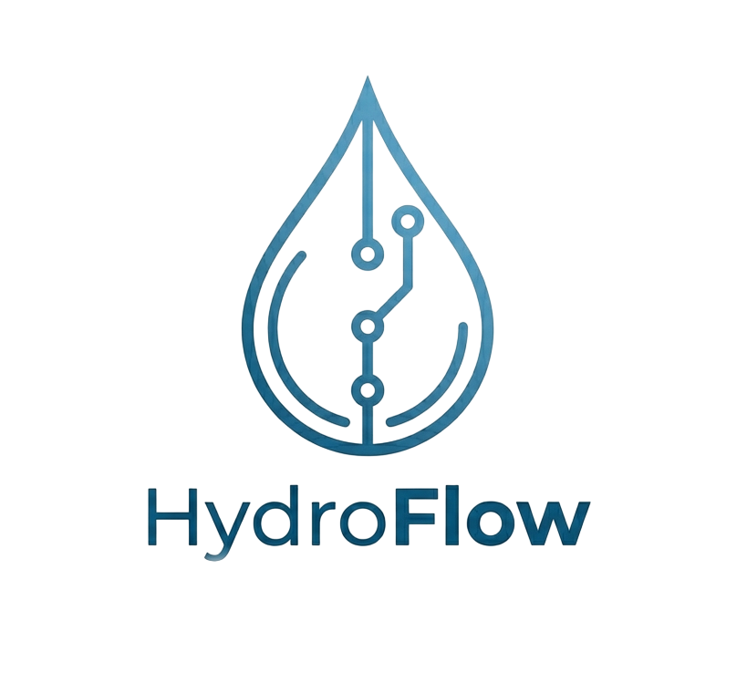
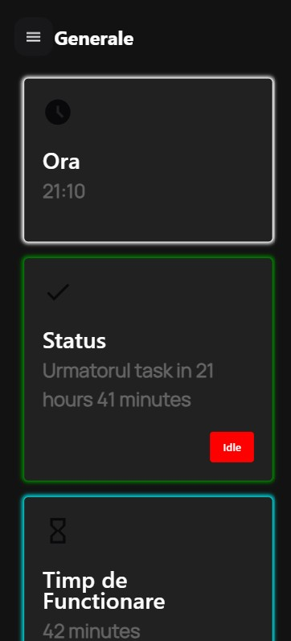
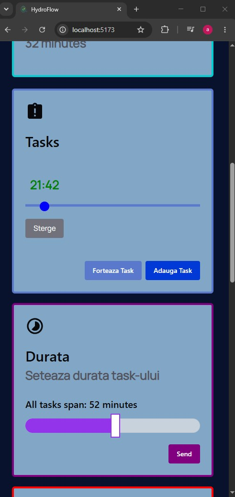
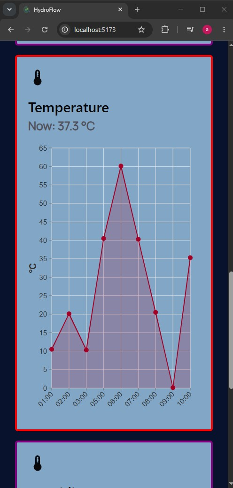
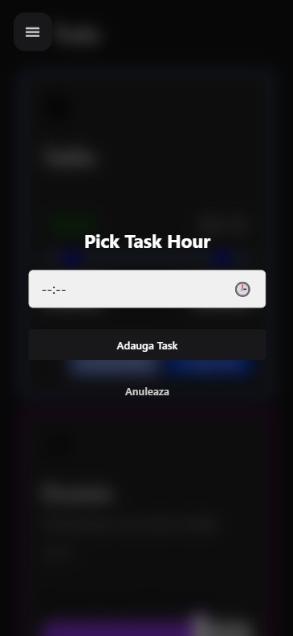

  
  <h2> React+Capacitor+Chakra-UI App for an awesome <a href="https://github.com/alexxnder1/HydroFlow-ESP32">Smart Irrigation System</a>.</h2>
  
HydroFlow is an amazing IoT-Based Smart Irrigation System that can distrubte a large volume of water for your garden needs.
  

  
Uses Gradle in order to be deployed on Android devices.

<h3><b>🌟 Features:</b></h3>
<ul>
<li>Automated Tasks for Irrigation</li>
<li>Linked with other devices through your own Home Router.</li>
<li>Notifications</li>
<li>Task Management</li>
<li>WebSocket</li>
</ul>

  
  
  
  
  

